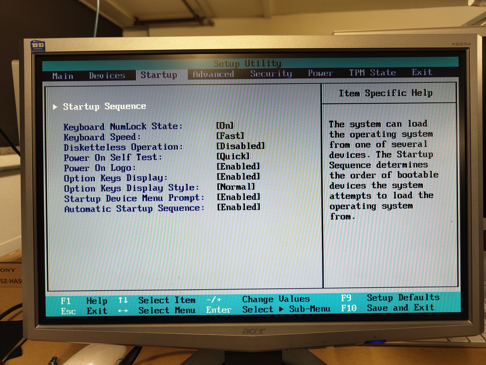
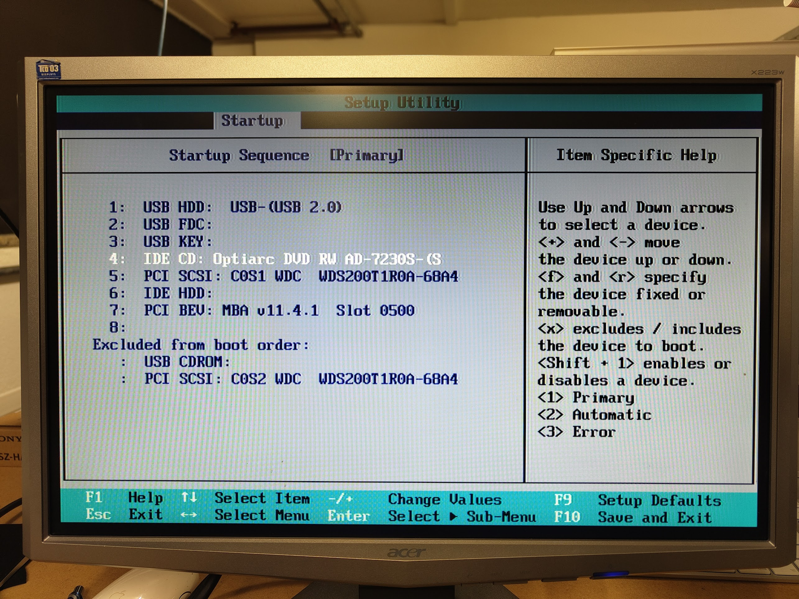
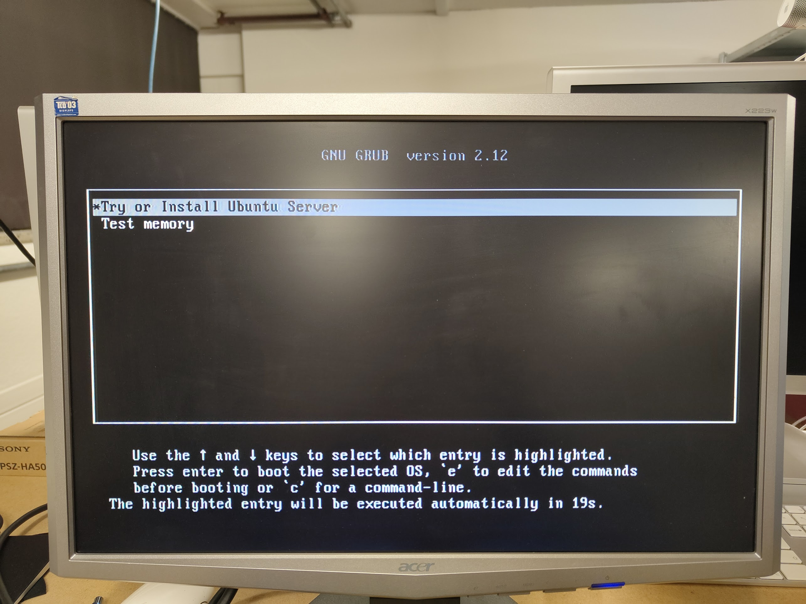
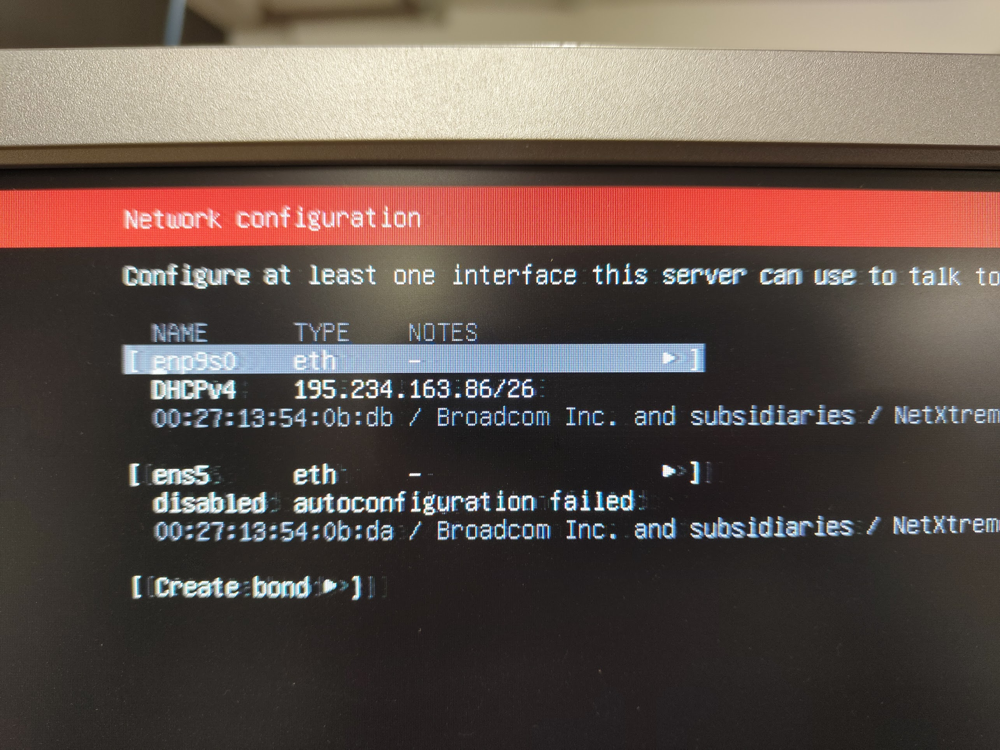
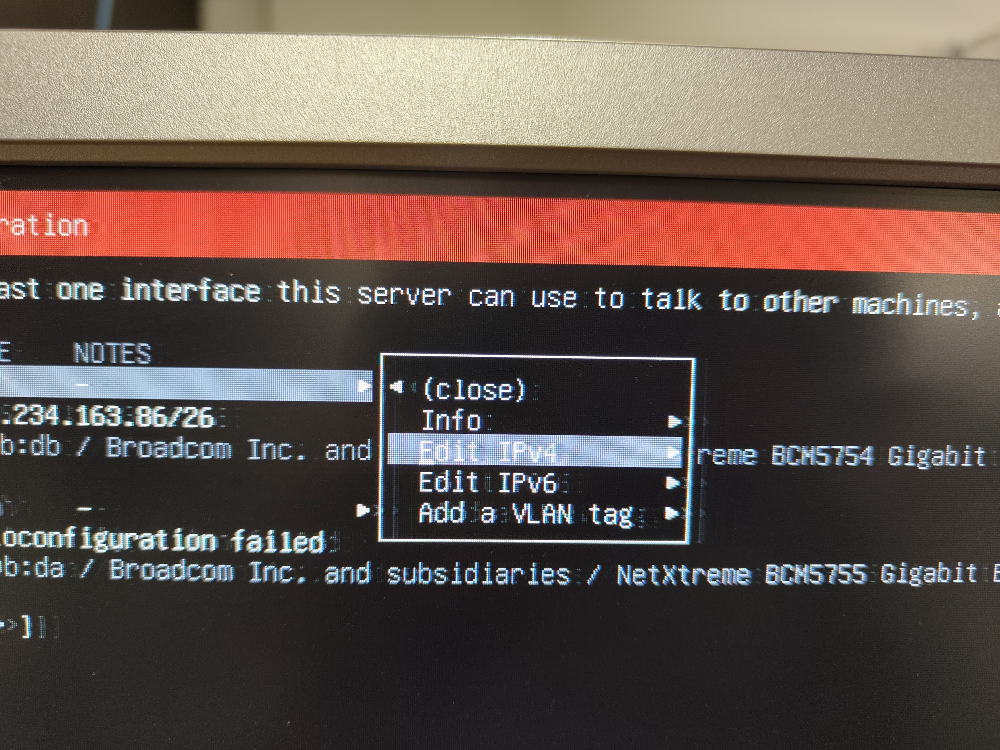
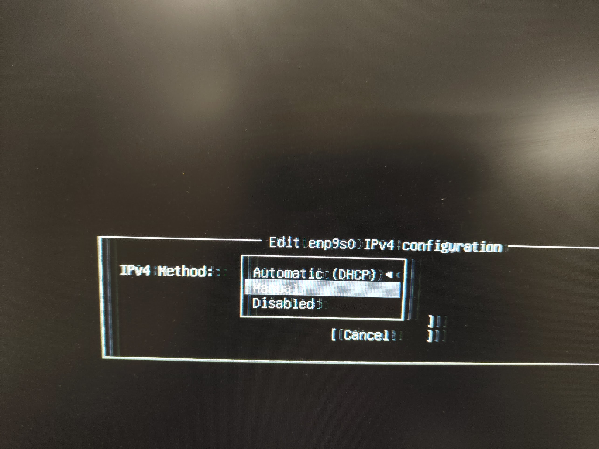
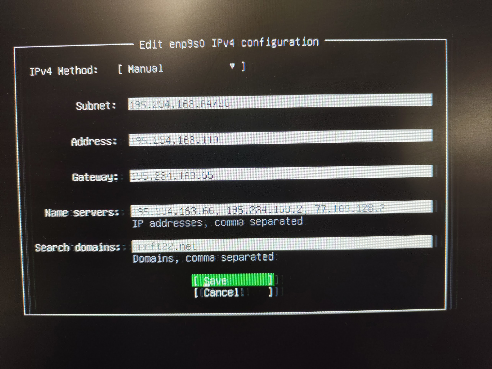
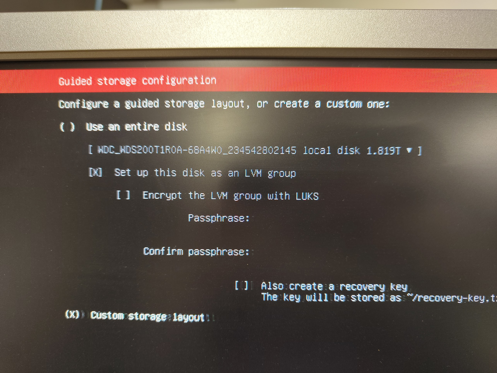
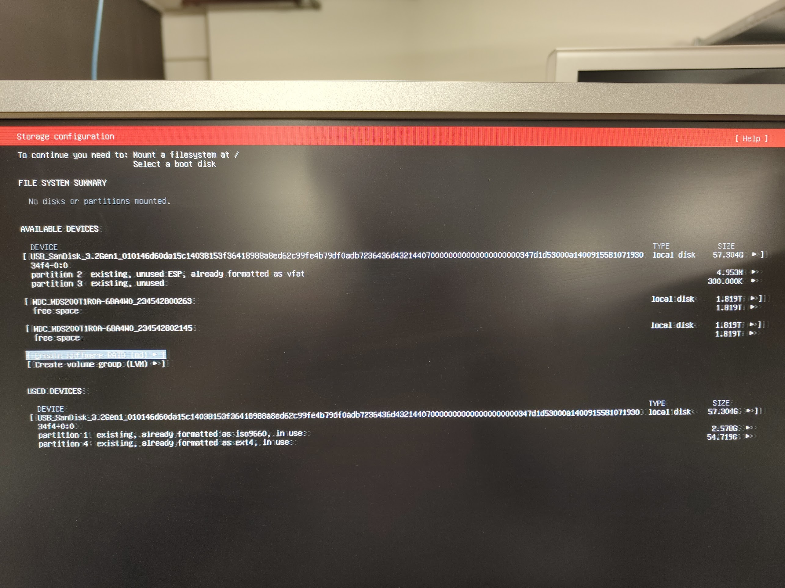
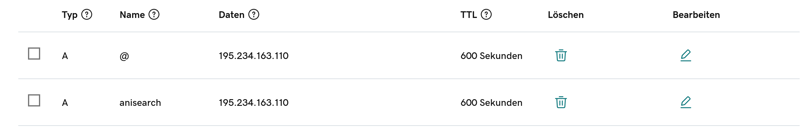

# Server Installation

## Inhaltsverzeichnis
- [Server Installation](#server-installation)
  - [Inhaltsverzeichnis](#inhaltsverzeichnis)
  - [Hardware installieren und vorbereiten](#hardware-installieren-und-vorbereiten)
    - [Ziel](#ziel)
    - [Zutaten](#zutaten)
    - [Arbeitsschritte](#arbeitsschritte)
  - [Betriebssystem installieren und konfigurieren](#betriebssystem-installieren-und-konfigurieren)
    - [Ziel](#ziel-1)
    - [Zutaten](#zutaten-1)
    - [Arbeitsschritte](#arbeitsschritte-1)
      - [1. Bootfähigen USB-Stick erstellen](#1-bootfähigen-usb-stick-erstellen)
      - [2. Server booten](#2-server-booten)
      - [3. Betriebssystem installieren](#3-betriebssystem-installieren)
  - [Remote SSH-Zugriff einrichten](#remote-ssh-zugriff-einrichten)
    - [Ziel](#ziel-2)
    - [Zutaten](#zutaten-2)
    - [Arbeitsschritte](#arbeitsschritte-2)
  - [Deployment](#deployment)
    - [Ziel](#ziel-3)
    - [Zutaten](#zutaten-3)
    - [Arbeitsschritte](#arbeitsschritte-3)
  - [Service-Konfiguration (Gunicorn)](#service-konfiguration-gunicorn)
    - [Nginx-Konfiguration](#nginx-konfiguration)
    - [Statische Webseiten](#statische-webseiten)
    - [Dynamische Webseiten](#dynamische-webseiten)
    - [Domainnamen (DNS-Verbindung)](#domainnamen-dns-verbindung)
    - [SSL Zertifikate (HTTPS einrichten)](#ssl-zertifikate-https-einrichten)
  - [Datenbank-Backups](#datenbank-backups)
    - [Ziel](#ziel-4)
    - [Arbeitsschritte](#arbeitsschritte-4)
  - [Mail-Server (Sendmail)](#mail-server-sendmail)
    - [Ziel](#ziel-5)
  - [Automatisierte Git-Pull-Action](#automatisierte-git-pull-action)
    - [Ziel](#ziel-6)
    - [Arbeitsschritte](#arbeitsschritte-5)
  - [Debugging](#debugging)
  - [Zusammenfassung](#zusammenfassung)
  - [Theorie](#theorie)
  - [Links](#links)
  - [Fragen](#fragen)
  - [To Do](#to-do)

---

## Hardware installieren und vorbereiten

### Ziel
Einen Server für die Installation eines Betriebssystems vorbereiten.

### Zutaten
- Monitor (an Strom angeschlossen und mit dem Server verbunden)
- Server (Verwendetes Modell: ThinkStation D20, am Strom und Netzwerk angeschlossen)
- Zwei leere oder überschreibbare Festplatten/SSDs
- Mindestens 40 GB RAM
- Funktionierende Batterie

### Arbeitsschritte
1. Server-Setup:
   - SSDs einbauen und RAM erweitern.
  bild
   - Batterie prüfen und bei Bedarf ersetzen (Signalbereich prüfen: grün = gut).
  bild


2. Netzwerk-Interfaces identifizieren:
   - Falls der Server mehrere Ethernetnaschlüse besitzt müssen wir wissen welcher Anschluss welchen Namen trägt. Stecke ein Kabel in eines der Ethernetanschlüsse und führe folgenden Command aus:
   ```bash
   ip addr show
   ```
   - Nun werden alle aktiven und inaktiven Anschlüsse gezeigt. Ein aktiver Anschluss wird als "UP" angezeigt. Merke dir den Namen des Interfaces für später! (hier: enp9s0)
   ```bash
   3: enp9s0: <BROADCAST,MULTICAST,UP,LOWER_UP> mtu 1500 qdisc mq state UP group default qlen 1000
    link/ether 00:27:13:54:0b:db brd ff:ff:ff:ff:ff:ff
    inet 195.234.163.110/26 brd 195.234.163.127 scope global enp9s0
       valid_lft forever preferred_lft forever
    inet6 fda8:b2ef:f20b:ca46:227:13ff:fe54:bdb/64 scope global dynamic mngtmpaddr noprefixroute 
       valid_lft 1655sec preferred_lft 1655sec
    inet6 fe80::227:13ff:fe54:bdb/64 scope link 
       valid_lft forever preferred_lft forever
   ```
3. BIOS-Taste identifizieren:
  - Mit dieser Taste bootet man das Betriebsystem im nächsten Schritt. Je nach Hersteller ist sie unterschiedlich. Finde das Modell des Servers heraus:
  ```bash
  sudo dmidecode -t system  
  ```
  Finde deine BIOS-Taste(n):
  ```bash
  +-------------+-----------------------+
| Hersteller  | BIOS-Taste(n)        |
+-------------+-----------------------+
| ASUS        | F2 oder Del          |
| Acer        | F2                   |
| Dell        | F2 oder F12          |
| HP          | Esc, F10 oder F2     |
| Lenovo      | F1, F2 oder Fn + F2  |
| MSI         | Del oder F2          |
| Gigabyte    | Del oder F2          |
| Toshiba     | F2 oder Esc          |
| Samsung     | F2                   |
+-------------+-----------------------+
  ```

---

## Betriebssystem installieren und konfigurieren

### Ziel
Ein Betriebssystem installieren und den Server somit bereit für Speicherung und Internetzugang machen.

### Zutaten
- USB-Stick
- Remote-PC oder Laptop mit Linux und Internetzugang
- Server
- BIOS-Taste und Name des Netzwerkinterface (hier: F1, enp9s0)

### Arbeitsschritte
#### 1. Bootfähigen USB-Stick erstellen
- Lade das gewünschte Betriebssystem (z. B. [Ubuntu Server](https://ubuntu.com/download/server)) auf dem remote-Gerät herunter.
- Stecke den USB-Stick ein und identifiziere den USB-Stick mit `sudo lsblk`. Aus folgendem Output kann man sehen dass der Stick den Path `/dev/sda` hat mit einer Partition `/dev/sda/sda1`!
  ```bash
  sudo lsblk
  ```
  ```bash
  sda           8:0    1 114.6G  0 disk 
  └─sda1        8:1    1 114.6G  0 part /media/zoe/E71C-66DE
  ```
- Kopiere das ISO-Image auf den Stick, wir überschrieben nun die KOMPLETTE Disk und nicht nur eine Partition! Die Partitionstabelle ist bereits auf dem ISO-Image:
  ```bash
  sudo dd if=/path/to/filename.iso of=/dev/sda bs=4M status=progress oflag=sync
  ```
#### 2. Server booten
- Schließe den bootfähigen USB-Stick an den ausgeschalteten Server an.
- Starte den Server und drücke sofort wiederholt die BIOS-Taste, um ins BIOS (hier UEFI) zu gelangen.
- Gehe ins StartUp-Menu, zur Bootreihenfolge. Hier werden alle angeschlossenen Geräte aufgelistet. Das oberste davon hat oberste Priorität und wird beim Bootvorgang gewählt um zu booten!
{width=300px} {width=300px}
- Passe die Bootreihenfolge an (USB-Stick muss an erster Stelle stehen!). Die SSDs müssen ebenfalls in die Bootreihenfolge!
- Save and Exit. Nun bootet das System vom Memory Stick! Wähle try and Install Ubuntu Server
{width=300px}

#### 3. Betriebssystem installieren
- Folge der [Ubuntu Server Installationsanleitung](https://ubuntu.com/tutorials/install-ubuntu-server#1-overview).
- Hier steht wie man in einer solchen Umgebung sich fortbewegt: 
1. `Willkommen`: Sprche wählen (ich empfehle English damit man bei Errors gut im Internet Hilfe holen kann!)
2. `Installer Aktualisierung verfügbar`: Immer aktualisieren falls das kommt und wenn es nicht kommt dann auch gut!
3. `Keyboard-Konfiguration`: Schweizer-Keyboard
4. `Choose your Type of Installation`: Das normale Ubuntu wählen
  - Sprache und Tastatur (z. B. Deutsch, Schweizer Layout).
  - Netzwerkeinstellungen: Hier geht man von einer statischen IP-Adresse aus!
  - Partitionierung enthält: SWAP-Partition, Boot-Partition, RAID1-Partition.
5. `Network Konfiguration`: Wenn wir eine Ethernet-Netzwerkverbindung wollen müssen wir hier das Netzerkinterface anwählen welchens wir und gemerkt haben, denn dort ist das Ethernetkabel eingesteckt.
{width=300px} {width=300px}
{width=300px} {width=300px}
6. `Proxy-Konfiguration`: Ignorieren
7. `Ubuntu Archive Mirror Configuration`: Ignorieren
8. `Guided Storage Configuration`: Wir wollen die Partiotionen manuell und Custom machen. Wir erstellen ein Raid1 mit einer Spiegelung sodass beide Disks den selben Inhalt haben und eine dadurch wie als Sicherheitskopie der anderen dient! (Achtung die Informationen im Bild 2 sind falsch, es dient nur zur orientiereung!)
Jede Disk hat 3 Partitionen die man manuell definiert: SWAP (2GB), / (1.8TB), /boot (2GB). Im 2ten Schritt definiert man das Raid1 (/- und /boot-Partition)
{width=300px} {width=300px}
Mit `sudo lsblk` kannst du im nachinein dann die Partitionstabelle ansehen im Terminal, hier ein Beispiel:
```bash
sda       8:0    0   1,8T  0 disk  
├─sda1    8:1    0     1M  0 part  
├─sda2    8:2    0     2G  0 part  
│ └─md0   9:0    0     2G  0 raid1 /boot
├─sda3    8:3    0     2G  0 part  [SWAP]
└─sda4    8:4    0   1,8T  0 part  
  └─md1   9:1    0   1,8T  0 raid1 /
sdb       8:16   0   1,8T  0 disk  
├─sdb1    8:17   0     1M  0 part  
├─sdb2    8:18   0     2G  0 part  
│ └─md0   9:0    0     2G  0 raid1 /boot
├─sdb3    8:19   0     2G  0 part  [SWAP]
└─sdb4    8:20   0   1,8T  0 part  
  └─md1   9:1    0   1,8T  0 raid1 /
```
9. `Userprofil erstellen`: Name, Servername, Username, Passwort erstellen und merken (hier bitte ein starkes Passwort nehmen damit die Daten des Servers geschützt sind, deshalb ist dir zu raten ein 10 bis 15-stelliges Passwort zu generieren und aufzuschrieben!)
---

## Remote SSH-Zugriff einrichten

### Ziel
Einen sicheren Zugriff auf den Server von einem externen Gerät ermöglichen.

### Zutaten
- Remote PC oder Laptop mit OpenSSH installiert und einem Key-Pair vorhanden!
- Server
- OpenSSH

### Arbeitsschritte
1. Installiere openssh auf dem Server. (falls der ssh und sshd service nicht aktiv sind dann aktiviere diese, sollte aber nicht der Fall sein)
   ```bash
   sudo apt update
   sudo apt install openssh-server
   ```
2. Erstelle SSH-Keys auf dem Server:
   ```bash
   ssh-keygen -t rsa -b 4096
   ```
3. Falls bereits vergessen, finde die IP-Adresse des Serves heraus (hier: 195.234.163.110):
   ```bash
   ip addr show
   ```
   ```bash
   3: enp9s0: <BROADCAST,MULTICAST,UP,LOWER_UP> mtu 1500 qdisc mq state UP group default qlen 1000
       link/ether 00:27:13:54:0b:db brd ff:ff:ff:ff:ff:ff
       inet 195.234.163.110/26 brd 195.234.163.127 scope global enp9s0
          valid_lft forever preferred_lft forever
       inet6 fda8:b2ef:f20b:ca46:227:13ff:fe54:bdb/64 scope global dynamic mngtmpaddr noprefixroute 
          valid_lft 1643sec preferred_lft 1643sec
       inet6 fe80::227:13ff:fe54:bdb/64 scope link 
          valid_lft forever preferred_lft forever
   ```
4. Kopiere den Public Key vom Client auf den Server:
   ```bash
   ssh-copy-id username-server@ip-address-server
   ```
5. Als Authentifizierung solltest du im nächsten Schritt dann das Passwort des Servers eingeben und bei der Frage wegen des Fingerprints ja antworten damit der Server unter den `known_hosts` auf dem CLient gespeichert wird und der Client unter `authorized_keys`!
6. Nun sollte man sich in Zukunft von diesem Client auch ohne Passwort in den Server hacken können mit ssh!

---

## Deployment

### Ziel
Webseiten auf den Server abspeichern und laden, die über einen Browser zugänglich sind.

### Zutaten
- nginx
- Projektdateien
- gunicorn (als Systemd-Service)

### Arbeitsschritte
1. Websiten hosten (statische files ablegen und dynamische websites services einrichten)
2. HTTP-Verkehr einrichten und website die gehostet sind auf den server an die öffentlichkeit bringen.
3. Domainnamen.
4. SSL-Zertifikate.

---
## Service-Konfiguration (Gunicorn)
- das wird nur bei dynamischen website benötigt und sorgt dafür dass die applikation ständig läuft auf dem server und dann auch stängig http(s)-requests entgegen nehmen und beantworten kann!
- wenn man mehrere website-services hat muss man achten dass jede applikation zwar auf dem localhost läuft aber jeweils auf einem anderen port!
- hier gehe ich von einer python flak applikation auf mit gunicorn im venv installiert!

1. zuerst solltes du tsten ob die app mit gunicorn funktiniert! aktiviere das venv und Starte die App mit Gunicorn, unter localhost:8000 soltest du nun im browser darauf zugreifen können!: merke dir diesen command!
   ```bash
   gunicorn --workers 3 --bind 0.0.0.0:8000 python_filename_ohne_pyendung:app_name
   ```
2. wenn das funktioniert hat dann richte den systemd-servcice ein mit der selber zeile die augferufen wird wenn man den service startet! (ersetze `app_name` mit irgendeinem passenden namen für deine app)
   ```bash
   sudo nano /etc/systemd/system/app_name.service
   ```
3. Ändere folgende Punkte:
- descritpion -> passend für deine website
- user -> bei welchem user der service gehostet?
- workingdirectory -> pfad zum projektordner (absolouter pfad!)
- execstart -> der command der die application vorher zum runen bringt mithilfe von gunicorn! hier ersetze `0.0.0.0` mit dem `127.0.0.1` und ersetze `gunicorn` mit dem pfad zum gunicorn executable im venv des projekts!

4. ctrl. + o, dann enter, dann ctrl. + x (speicher und exit)

5. daemon reloaden und den service starten und status überprüfen:
   ```bash
   sudo systemctl daemon-reload
   sudo systemctl start servicename.service
   sudo systemctl status servicename.service
   ```
6. wenn der service problemlos läuft dan enable ihn:
   ```bash
   sudo systemctl enable servicename.service
   ```
7. nun kannst du in einem nächsten schritt die website erreichbar machen mit nginx!

---

### Nginx-Konfiguration
Für jede Website braucht es eine nginx-Konfiguration die http(s)-Requests und Responses handled! Je nachdem ob die Website statisch oder dynamisch ist variiert die Konfigurationsdatei ein wenig!

### Statische Webseiten
- mehrere statische wbsites teilen sich eine doamin und unterscheiden sich ledigich in ihrem url-parameter
- nginx hilkt html files und schikt diese an den browser
- ein beispiel zur gesamten konfiguration wie man es machen kann findest du aif github: https://github.com/oezilot/Tamagotchi-Server-Scripts/blob/master/static_nginx_conf 

1. Nginx installieren, service starten, enablen und den Port 80 offen halten.
   ```bash
   sudo apt install nginx
   ```
2. Statische Files ablegen: im erstellten Ordner von nginx `(/var/www/html)` oder in einem anderen `(~/Projcts/Projektname)`.

3. Erstelle eine Konfigurationsdatei, in dieser Konfigdatei werden die Konfigurationen für alle statischen Websiten gemacht werden! Man kann aber auch für jede statsche Website eine seperate Konfigurationsdatei machen wenn man das unbedingt will. Ersetze `static_nginc_config` mit deinem gewünschten Namen für die Datei:
   ```bash
   sudo nano /etc/nginx/sites-available/staic_nginx_config
   ```
  
4. Fülle die Datei mit dem Ihnalt des Files `static_nginx_conf` auf Github, lösche alles was mit SSL zu tun hat und passe folgende Punkte an:
  `root pfad/zu/deinem/projekt` -> der Ordner in welchem deine html-datei ist
  `server_name ip_adresse_des_servers`-> IP-adresse des Servers (später kommt hier dann die Domain hin, eine Domaine reicht für mehrere statische websites zum teilen)
  `location /url-parameter` -> hier definierst du den url-parameter auf welcher der nginx-server lauscht (wenn du schreibst `location /x` ist lauscht nginx auf `http://IP-Adresse/x` und wenn du schreibst `location /` dann hört nginx einfach auf alles `http://IP-Adresse/x`). 
  `try_files $uri $uri/ =404` oder `index salat.html;` -> diese Zeile sorgt dafür auf den http-request mit dem oben  genannten url zu reagieren und die statischen files zu holen. Es gitb 2 Möglichkeiten dies zu tun! Entweder man schreibt hier einfach den pfad des targetfiles relativ zum root ordner hin oder man nutzt die funktion `try_files` welche je nach eingegebenem url-parameter dann ein passendes file im root-ordner sucht (wenn du also `http://ip-adresse/salat.html` eingibtst dann sucht nginx das file mit dem namen salat.html im root-verzeichnis! Für diesen Fall muss loaction aber `location /` sein!!!) 
1.  Ctrl. + o, dann Enter, dann ctrl. + x (speichern und exit)
2.  Kreiere eienen Symlink der Konfigurationsdatei von Ordner `/sites-available` zu /`sites-enabled` (in sites-available sind alle configfiles der websiten die du definierst und in sites-enabed sind alle aktiven und erreichbaren konfiguratonen!)
    ```bash
    sudo ln -s /etc/nginx/sites-available/static_nginx_conf /etc/nginx/sites-enabled/
    ```

3.  Lade nginx und den Daemon neu:
    ```bash
    sudo systemctl daemon-reload
    sudo systemctl restart nginx
    ```
   
4.  Nun sollte die statische Website mit folgendem url erreichar im Browser erreichbar seim: `http://IP-Adresse-Server/website-template.html` oder `http://IP-Adresse/url-parameter` oder `http://IP-Adresse/url-parameter` (je nach der location im config beschrieben!)
   

### Dynamische Webseiten
- jede dynamische website muss eine einĝene domäne haben!
- nginx leitet http-request an die applikation weiter
- ein beispiel zur gesamten konfiguration wie man es machen kann findest du aif github: https://github.com/oezilot/Tamagotchi-Server-Scripts/blob/master/anime_api_nginx_conf

1. Es gibt 2 Möglicheiten um die html-files einer dynamischen Application abuzulegen. Hier erkläre ich nur die Version B weil die besser ist in meinen Augen! Lege deshalb also die files des projekts we normal in `~/Projects/Projektname` ab und nicht im `/var/www/html`!
   - A: man definiert jeden endpunkt (template) der application in nginx und lässt nginx die verschiedenen url-parameter handlen (hier sagt die applikation dem nginx dass es file x dem browser schicken sollte und nginx holt es dann und schickt es zum brwser)
   - B: man definiert nur die ganze website als solches im nginx und lässt die applikation selbrer das url-parameter handlen. (hier schickt die applikation das file zu nginx wodurch nginx dies gleich weiterleiten kann zum brwser)
2. Erstelle eine Konfigurationsdatei, für jede Applikation eine seperate datei! Ersetze `static_nginc_config` mit deinem gewünschten Namen für die Datei:
   ```bash
   sudo nano /etc/nginx/sites-available/staic_nginx_config
   ```
3. Folgende anpassungen sind zu treffen oder zu beachten im Konfigurationsfile!
   - `server_name _` `listen id-adresse:portnummer`-> wenn man keine domain hat muss man einen anderen port nutzen des nginx-servers um die verschiedenen websiten zu unterscxheiden (nicht empfohlen und nur vorübergehend einzusetzen!!!) jede dynamische applikation muss seine eigene domaine oder subdomaine haben! 
   - `location /` -> alle url-parameter werden zu  applikation weitergleitet (version B)
   - `proxy_pass http://127.0.0.1:5000/` -> leitet http-request zu dem service der auf pot 5000 läuft auf dem localhost weiter denn dort läuft die applikation! es werden alle request mit url-parameter x weitergeleitet (wenn z.b. `http://127.0.0.1:5000/login` stehen würde würde nur alle requests mit dem login-parameter an die applikation weitergeleitet werden!). die restlichen proxy-sachen einfach übernehmen vom beispel-file von github!
4. Die website sollte nun auf folgendem url-erreichbar sein: http://ip-adresse:portnummer (nur wenn bereits ein service exitiert natürlich!!!)
---

### Domainnamen (DNS-Verbindung)
1. Kaufe eine Domain (z.b. bei GoDaddy, Cloudflare etc).
2. Richte DNS-Records ein, um Domains mit dem Server zu verbinden. Einen record für den server selber und einen record für jede dynamische website die ihre eigene subdomain benötigt! (hier: ip-adresse-server = flumini.ch, anime-website = anisearch.flumini.ch) (mache das auf der website oder mit dem api der website, ahtung: wenn man es mit der api des dns-servers machen will dann ict godaddy nicht geeignet weil man keine recht hat, migriere in diesem fall die damäne zu cloudflare und wechlse die dns-servers). (godaddy: https://dcc.godaddy.com/control/portfolio/flumini.ch/settings?tab=dns&itc=mya_vh_buildwebsite_domain)
   {width=600px}
3. hinterlege die domainnamen im nginx-konfigfile auf der zeile `servername`
   ```bash
   # /etc/nginx/sites-available/staic_nginx_config
   server_name flumini.ch

   # dynamische website
   server_name anisearch.flumini.ch;
   ```
---

### SSL Zertifikate (HTTPS einrichten)
- folgende anleitung hat mir den arsch gerettet: https://www.digitalocean.com/community/tutorials/how-to-secure-nginx-with-let-s-encrypt-on-ubuntu-22-04#step-3-allowing-https-through-the-firewall

1. Installiere Certbot:
   ```bash
   sudo apt install certbot
   ```
2. ändere die firewall konfiguration sodass sie nun auch https-request annimmt und nicht nur http!
   ```bash
   sudo ufw allow 'Nginx Full'
   sudo ufw delete allow 'Nginx HTTP'
   ``` 
3. Hole ein Zertifikat für deine domain: (dieser command fügt dann dein zertifikat-links direkt in deine nginx-konfigurationsdatei ein, für das muss aber die domain bereits in der nginx-konfiguration stehen!)
   ```bash
   sudo certbot --nginx -d yourdomain.com
   ```

4. Konfiguriere automatisches Erneuern der Zertifikate.
   ```bash
   sudo systemctl status snap.certbot.renew.service
   ```

---

## Datenbank-Backups

### Ziel
Automatisierte Backups der Datenbank erstellen.

### Arbeitsschritte
- Installiere SQLite3, um die Datenbank manuell zu testen.
- Erstelle ein Backup-Skript und richte es als Service ein.

---

## Mail-Server (Sendmail)

### Ziel
Einen Mail-Server einrichten (z. B. mit Sendmail).

---

## Automatisierte Git-Pull-Action

### Ziel
Automatische Synchronisation bei Pushes auf den Deployment-Branch.

### Arbeitsschritte
1. Installiere Git und konfiguriere die SSH-Keys.
2. Erstelle ein GitHub-Workflow-Skript für automatische Pull-Aktionen.

---
## Debugging
- Überprüfe Firewalls und laufende Services.
- Stelle sicher, dass alle notwendigen Ports geöffnet sind (z. B. 80, 443 für HTTP/HTTPS, 22 für SSH).
- Prüfe die Logs der Services:
  
  sudo journalctl -u <service-name>
  
- Teste die Konnektivität zwischen Geräten mit ping und telnet.
- Stelle sicher, dass die Systemressourcen ausreichend sind (RAM, CPU, Speicherplatz).
- Überprüfe die Syntax und Integrität von Konfigurationsdateien, z. B. für nginx:
  
  sudo nginx -t
  
- Nutze Debugging-Werkzeuge wie strace, tcpdump oder netstat, um detaillierte Einblicke in Probleme zu erhalten.
- Überprüfe, ob die Dienste korrekt gestartet sind und im Hintergrund laufen:
  
  sudo systemctl status <service-name>
  

---

## Zusammenfassung
- Ergebnis: Ein funktionierender Server mit gehosteten Webseiten.
- Wichtige Daten:
  - Statische IP: 195.234.163.110
  - Domains: tamagotchi.werft22.net, flumini.ch

---

## Theorie
- Details zu RAID1, SSH, DNS und SSL/TLS.

---

## Links
- [Bootable USB Stick erstellen](https://pendrivelinux.com/create-bootable-usb-from-iso-using-dd/)
- [Let’s Encrypt Anleitung](https://www.digitalocean.com/community/tutorials/how-to-secure-nginx-with-let-s-encrypt-on-ubuntu-22-04)

---

## Fragen
- Wie kann man Notifications für Serverausfälle einrichten?
- Warum erfordert GitHub keine Passwortabfrage?

---

## To Do
- Applikationen hochladen
- Backups und GitHub Actions testen
- Serverdokumentation abschließen
